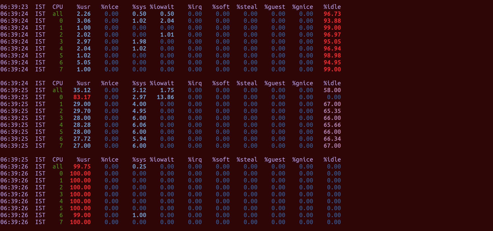
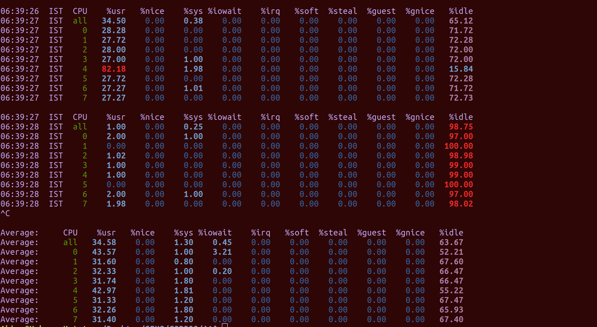
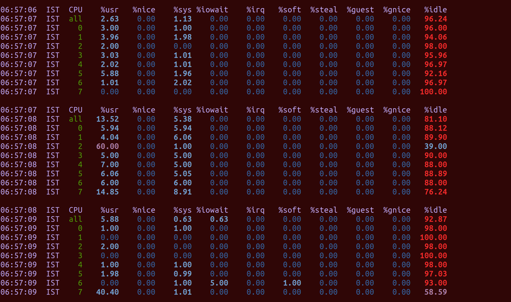
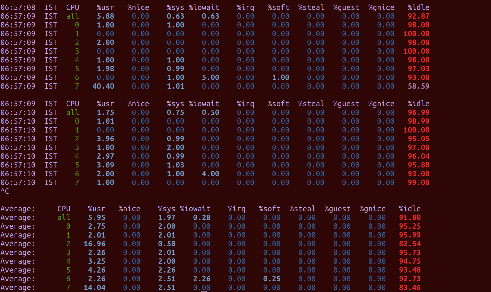
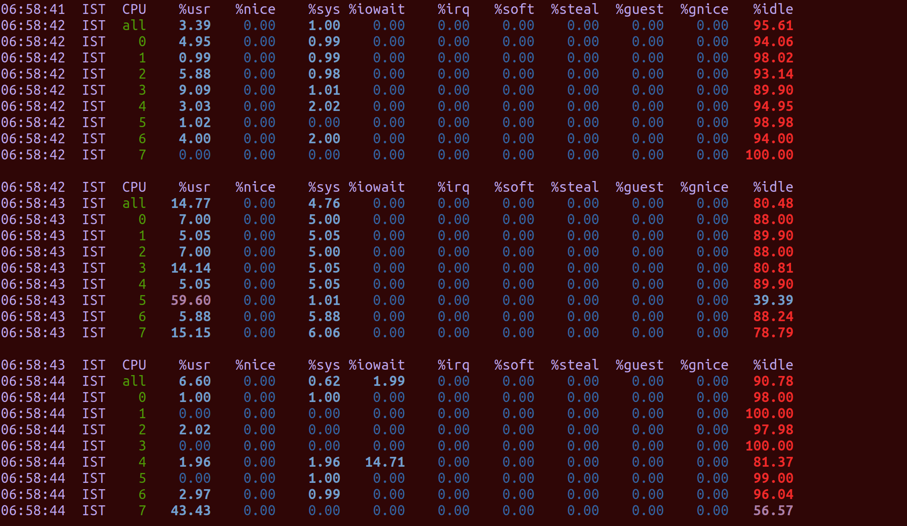
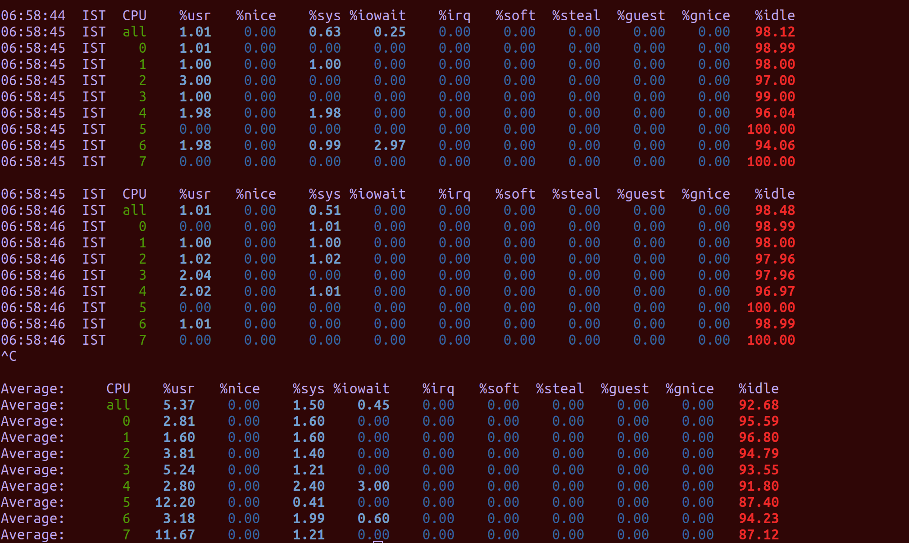
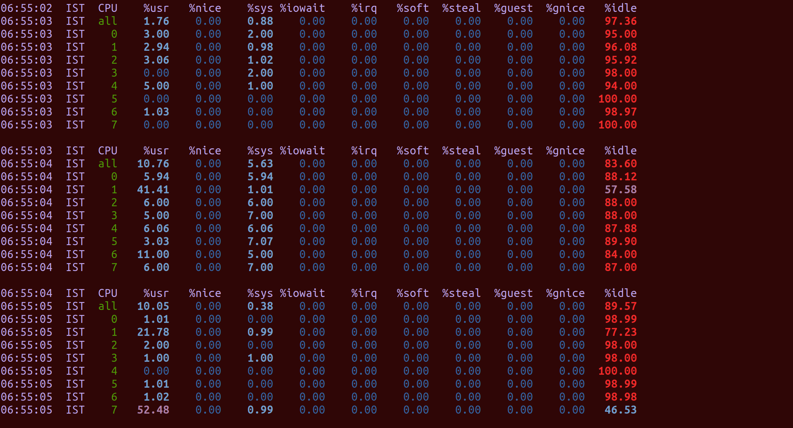
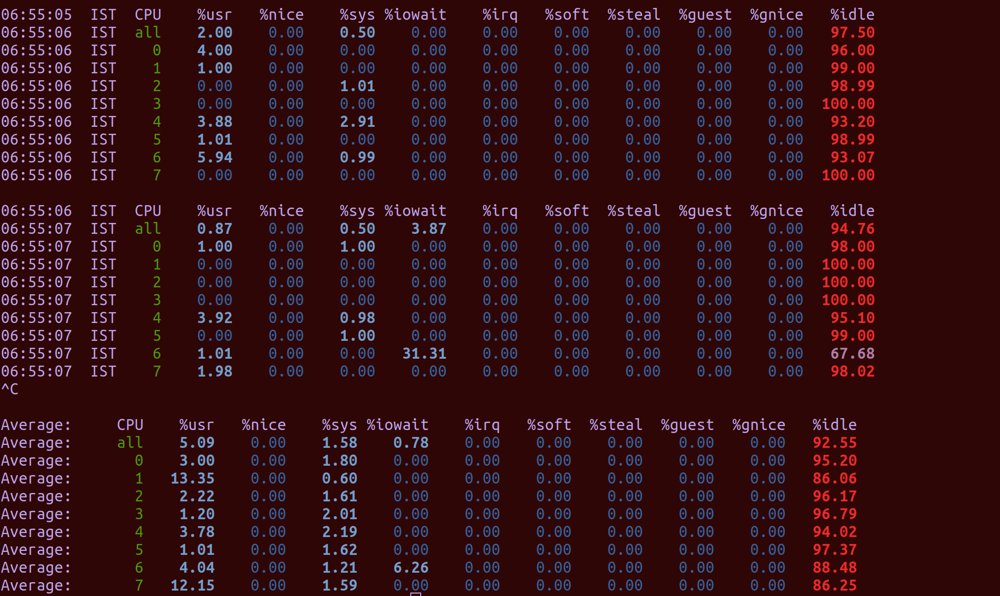

# Contents
- [Contents](#contents)
- [Introduction](#introduction)
- [Description](#description)
  - [Fully connected forward computation](#fully-connected-forward-computation)
    - [MKL implementation](#mkl-implementation)
    - [OpenBLAS implementation](#openblas-implementation)
    - [pthread implementation](#pthread-implementation)
  - [Activation functions](#activation-functions)
    - [ReLU (Rectified Linear unit)](#relu-rectified-linear-unit)
    - [Tanh](#tanh)
  - [Pooling operation](#pooling-operation)
    - [Max pooling](#max-pooling)
    - [Average pooling](#average-pooling)
  - [Probability operations](#probability-operations)
    - [Sigmoid](#sigmoid)
    - [Softmax](#softmax)
- [Analysis of runtime of various _fullyconnected computation_ implementations](#analysis-of-runtime-of-various-fullyconnected-computation-implementations)
  - [GNU plots obtained](#gnu-plots-obtained)
    - [Simple O($n^3$) for-loop based implementation](#simple-on3-for-loop-based-implementation)
    - [MKL based implementation](#mkl-based-implementation)
    - [OpenBLAS based implementation](#openblas-based-implementation)
    - [Pthread based implementation](#pthread-based-implementation)

# Introduction
Welcome to **Audio Processing Library Version 1.2**. 

V1.2 supports the following functionalities:
- Fully connected forward computation
  - Simple matrix multiplication with O($n^3$) for loop based computations
  - Implementation using Intel MKL library
  - Implementation using OpenBLAS library 
  - Implementation using pthreads in C++ (multi-threading to reduce computational complexity)
- ReLU and Tanh activations
- Max pooling and average pooling operations
- Sigmoid and Softmax probabilities

What's new in V1.2?
The matrix multiplication operation in the Fully connected forward computation has been accelerated using the following techniques:
- Implementation using Intel MKL library to provide hardware-based acceleration
- Implementation using OpenBLAS library
- Implementation using pthreads library of C++, to support the creation and synchronization of multiple threads, utilizing the resources of multiprocessing systems

# Description
## Fully connected forward computation
- **Functionality implemented**: output_matrix = input_matrix*weight_matrix + bias_matrix
###  implementation
- **Name of the function**: fc; defined in fullyconnected.cpp
- **Inputs**: path of file containing input matrix (AxB dimensions) with 32-bit floats, path of file containing weight matrix (BxC dimensions) with 32-bit floats, path of file containing bias matrix (AxC dimensions) with 32-bit floats, path of file to write output matrix (AxC dimensions) with 32-bit floats, all written in specified matrix format
- **Usage (Command line instruction)**: ./yourcode.out fullyconnected inputmatrix.txt weightmatrix.txt biasmatrix.txt outputmatrix.txt (only 6 arguments, no extra arguments for to support the _fullyconnected_ argument information).

### MKL implementation
- **Name of the function**: fc_mkl; defined in fc_mkl.cpp
- **Inputs**: path of file containing input matrix (AxB dimensions) with 32-bit floats, path of file containing weight matrix (BxC dimensions) with 32-bit floats, path of file containing bias matrix (AxC dimensions) with 32-bit floats, path of file to write output matrix (AxC dimensions) with 32-bit floats, all written in specified matrix format
- **Usage (Command line instruction)**: ./yourcode.out fullyconnected **mkl** inputmatrix.txt weightmatrix.txt biasmatrix.txt outputmatrix.txt 

### OpenBLAS implementation
- **Name of the function**: fc_blas; defined in fc_opb.cpp
- **Inputs**: path of file containing input matrix (AxB dimensions) with 32-bit floats, path of file containing weight matrix (BxC dimensions) with 32-bit floats, path of file containing bias matrix (AxC dimensions) with 32-bit floats, path of file to write output matrix (AxC dimensions) with 32-bit floats, all written in specified matrix format
- **Usage (Command line instruction)**: ./yourcode.out fullyconnected **blas** inputmatrix.txt weightmatrix.txt biasmatrix.txt outputmatrix.txt 

### pthread implementation
- **Name of the function**: fc_pthread; defined in fc_pthread.cpp
- **Inputs**: path of file containing input matrix (AxB dimensions) with 32-bit floats, path of file containing weight matrix (BxC dimensions) with 32-bit floats, path of file containing bias matrix (AxC dimensions) with 32-bit floats, path of file to write output matrix (AxC dimensions) with 32-bit floats, all written in specified matrix format
- **Usage (Command line instruction)**: ./yourcode.out fullyconnected **pthread** inputmatrix.txt weightmatrix.txt biasmatrix.txt outputmatrix.txt 

## Activation functions
### ReLU (Rectified Linear unit)
- **Name of function**: myrelu; defined in activation.cpp
- **Inputs**: path of file containing input matrix (AxB dimensions) with 32-bit floats, path of file to write output matrix (AxB dimensions) with 32-bit floats, all written in specified matrix format
- **Usage  (Command line instruction)**: ./yourcode.out activation relu inputmatrix.txt outputmatrix.txt
- **Functionality implemented**: output_matrix = element_wise_max(0, input_matrix)

### Tanh 
- **Name of function**: mytanh; defined in activation.cpp
- **Inputs**: path of file containing input matrix (AxB dimensions) with 32-bit floats, path of file to write output matrix (AxB dimensions) with 32-bit floats, all written in specified matrix format
- **Usage  (Command line instruction)**: ./yourcode.out activation tanh inputmatrix.txt outputmatrix.txt
- **Functionality implemented**: output_matrix = element_wise_tanh(input_matrix)

## Pooling operation
### Max pooling
- **Name of function**: maxpool; defined in pooling.cpp
- **Usage  (Command line instruction)**: ./yourcode.out pooling max inputmatrix.txt stride outputmatrix.txt
- **Inputs**: path of file containing input matrix (AxB dimensions) with 32-bit floats, integer value of stride in pooling, path of file to write output matrix ((A/stride)x(B/stride) dimensions) with 32-bit floats, all written in specified matrix format
- **Functionality implemented**: output_matrix = max-pooling(input_matrix), where max-pooling(.) is the commonly used downsampling function, using the maximum value in (stride, stride) contiguous sub-matrices

### Average pooling
- **Name of function**: avgpool; defined in pooling.cpp
- **Inputs**: path of file containing input matrix (AxB dimensions) with 32-bit floats, integer value of stride in pooling, path of file to write output matrix ((A/stride)x(B/stride) dimensions) with 32-bit floats, all written in specified matrix format
- **Usage  (Command line instruction)**: ./yourcode.out pooling average inputmatrix.txt stride outputmatrix.txt
- **Functionality implemented**: output_matrix = average-pooling(input_matrix), where average-pooling(.) is the commonly used downsampling function, using the average value in (stride, stride) contiguous sub-matrices

## Probability operations
### Sigmoid
- **Name of function**: mysigmoid; defined in probability.cpp
- **Inputs**: path of file containing input vector (A elements) with 32-bit floats, path of file to write output vector (A elements) with 32-bit floats, all written in specified vector format
- **Usage  (Command line instruction)**: ./yourcode.out probability sigmoid inputvector.txt outputvector.txt
- **Functionality implemented**: output_vector = element_wise_sigmoid(input_vector), where sigmoid(x) = $\frac{1}{1+e^{-x}}$

### Softmax
- **Name of function**: mysoftmax; defined in probability.cpp
- **Inputs**: path of file containing input vector (A elements) with 32-bit floats, path of file to write output vector (A elements) with 32-bit floats, all written in specified vector format
- **Usage  (Command line instruction)**: ./yourcode.out probability softmax inputvector.txt outputvector.txt
- **Functionality implemented**: output_vector = softmax(input_vector), where softmax(x) = $\left[\frac{e^{x_i}}{\sum_{j\in \{1,..,|x|\}} e^{x_j}}\right]$

# Analysis of runtime of various _fullyconnected computation_ implementations
## GNU plots obtained
### Simple O($n^3$) for-loop based implementation

### MKL based implementation

### OpenBLAS based implementation

### Pthread based implementation

## CPU specifications and CPU usage 
The following CPU usage patterns were observed while running pthread-based implementation. We performed these tests on an intel x86_64 architecture with 8 cores. These were the CPU usage statistics we obtained after running our pthreads implementation on a 800x800 dimension matrix. 

As can be seen, before the function call most of the cores wer idle with a total of 96.73% idle. Once the command was run the idle time per cpu dropped and the total went down to 58%. After that it again increased and went up to 98.75%. This shows how the different threads ran on different cores (by the %idle time). 
We also observed CPU usage in case of the normal implementation as shown in the below figure.

We also observed CPU usage in case of the openblas implementation as shown in the below figure.

We also observed CPU usage in case of the mkl implementation as shown in the below figure.

In mkl, openblas and the normal (simple) implementation only 1 core dips down in %idle time and then it becomes normal again.

## Inferences
- Looking at the GNU plots, we can infer that our implementations of MKL, OpenBLAS and pthreads-based fullyconnected forward computation outperform our simple for-loop based implementation, as expected.
- Our pthreads-based implementation is comparable in performance to the implementations based on MKL and OpenBLAS, thus validating our multi-threading approach.
- Our pthreads implementation gives nearly 3x improvement in runtime latency, when compared with the simple for-loop implementation. (reference: 900x900 matrix multiplication)
- MKL and OpenBLAS give nearly 6x and 4x improvements in runtime latencies respectively, when compared with the simple for-loop implementation. (reference: 900x900 matrix multiplication)
- Pthreads implementation makes the maximum distributed usage of the CPU cores, which is indicated by the CPU usage patterns. 
